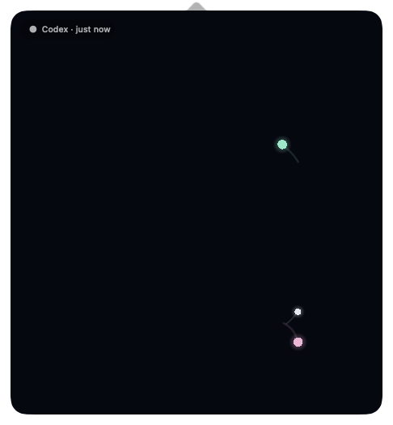

# agent-meong

한국어 | [English](README.en.md)

`agent-meong`은 같은 Mac에서 실행 중인 AI 에이전트의 활동을 단순한 점과
올챙이의 움직임으로 보여주는 macOS 메뉴 막대 앱입니다. 여러 작업을 맡긴 뒤 잠시
쉬면서도 일이 계속되는지, 하나씩 끝나가는지를 방해받지 않고 바라보는 경험을
목표로 합니다.

## 무엇을 보게 되나요

- 작업 중인 메인 에이전트는 메뉴 막대에서 통통 움직입니다.
- 메뉴 막대 아이콘을 누르면 아이콘에 붙은 Meong Space가 즉시 열립니다.
- 서브에이전트는 메인에서 태어나고, 종료가 관찰되면 메인으로 돌아가 흡수됩니다.
- 같은 메인·서브에이전트 가족은 상태가 바뀌어도 같은 계열의 색을 유지합니다.
- 한 번의 최상위 agent turn이 끝나면 메뉴 막대 신호와, 확인 전까지 해당 가족에
  남는 종료 흔적이 나타납니다.
- 활동과 오브젝트가 줄어드는 모습으로 일이 마무리되는 흐름을 느낄 수 있습니다.



이 앱은 상세 로그나 생산성 dashboard가 아닙니다. prompt, response, 명령, 파일 경로,
tool input/output을 수집하지 않으면서 최소한의 실제 lifecycle 신호만 시각화합니다.
기능과 디자인의 판단 기준은 [Product Principles](docs/product-principles.md)에 있습니다.

## 현재 범위와 제약

- macOS 14 이상에서 동작합니다.
- 현재 observation source는 OpenAI Codex 하나입니다.
- **이 Mac에서 로컬로 실행되는** ChatGPT desktop app의 Codex(Codex App)와 Codex
  CLI task만 관찰합니다. Codex cloud/web task, 다른 Mac, 원격 runner는 관찰하지
  않습니다.
- 기본 `~/.codex`를 공유하는 로컬 Codex App과 CLI는 한 번만 연결하면 됩니다.
- Codex App과 CLI의 활동을 모두 관찰할 수 있지만, 최초 command hook 보안 검토와
  신뢰에는 현재 Codex CLI의 `/hooks`가 필요합니다.
- 현재 공식 설치 방법은 이 GitHub 저장소의 source installer뿐입니다. 사전 빌드
  `.app`·`.zip`과 자동 업데이트는 의도적으로 나중으로 미뤘습니다.
- Codex가 제공하는 `Stop`은 한 번의 agent turn 종료 신호입니다. 전체 task/thread의
  성공이나 실패를 뜻하지 않으며, Codex가 주지 않는 결과는 추정하지 않습니다.

## 설치 전 확인

다음 항목이 필요합니다. `scripts/install-app`은 macOS, Xcode Command Line Tools,
Swift와 Python을 설치 전에 자동 확인하고, Codex CLI가 없으면 경고합니다. `/hooks`
지원 여부까지 포함해 미리 직접 확인하려면 아래 명령을 사용합니다.

- Xcode Command Line Tools와 Swift 6
- Command Line Tools가 제공하는 `/usr/bin/python3`
- `/hooks`를 지원하는 최신 Codex CLI
- 관찰할 로컬 Codex App 또는 Codex CLI

Terminal에서 확인합니다.

```bash
xcode-select -p
swift --version
/usr/bin/python3 --version
codex --version
```

`xcode-select -p`가 실패하면 `xcode-select --install`을 실행하고 설치가 끝날 때까지
기다리세요. Swift가 6.x가 아니면 Xcode Command Line Tools를 업데이트합니다.

`codex --version`이 실패하거나 Codex CLI에 `/hooks`가 없다면 OpenAI의
[Codex CLI 공식 설치 안내](https://developers.openai.com/codex/cli)를 따르거나 다음
공식 standalone installer로 설치·업데이트하세요.

```bash
curl -fsSL https://chatgpt.com/codex/install.sh | sh
codex --version
```

## 설치

```bash
git clone https://github.com/dkstm95/agent-meong.git "$HOME/agent-meong"
cd "$HOME/agent-meong"
bash scripts/install-app
```

스크립트는 build 필수 환경을 확인하고 release build와 ad-hoc 서명을 검증한 뒤
`~/Applications/AgentMeong.app`에 설치합니다. 또한 사용자 전용 자동 시작 항목을
설정하고 앱을 실행합니다. `sudo`는 필요하지 않습니다. Dock 아이콘은 없으며, 첫
실행에서는 메뉴 막대의 둥근 아이콘에 연결 안내가 자동으로 열립니다. 설치가 성공하면
큰 로컬 build cache인 `dist/`와 `macos/.build/`는 기본적으로 정리됩니다. 자동
업데이트가 없으므로 `$HOME/agent-meong`은 업데이트와 완전 제거를 위해 보관하세요.

## Codex 연결과 보안 확인

1. agent-meong 첫 화면에서 `연결하고 /hooks 복사`를 한 번 누릅니다.
2. 앱이 기존 설정을 보존하면서 기본 `~/.codex`에 사용자 hook을 추가하고, adapter를
   `~/Library/Application Support/AgentMeong/codex-hooks/` 아래에 설치한 뒤
   `/hooks`를 clipboard에 복사합니다.
3. 실행 중인 Codex App과 Codex CLI를 모두 완전히 종료하고 다시 엽니다. Codex는 실행
   중 변경된 `hooks.json`을 안정적으로 다시 읽지 않으므로 이 단계가 필요합니다.
4. 새로 연 Codex CLI의 local task에 `/hooks`를 붙여넣습니다.
5. `User config` source 아래의 정의가 다음 체크리스트와 모두 일치할 때만 신뢰합니다.

### `/hooks` 체크리스트

- `agent-meong activity [dev.ailab.agent-meong/v4]` handler가 정확히 다음 7개 event에
  하나씩 있습니다. 기존에 사용자가 설치한 다른 hook은 함께 보일 수 있으며 별도로
  검토해야 합니다.
  - `UserPromptSubmit`
  - `PreToolUse`
  - `PermissionRequest`
  - `PostToolUse`
  - `SubagentStart`
  - `SubagentStop`
  - `Stop`
- 이 7개 agent-meong handler의 type은 모두 `command`입니다.
- 각 agent-meong command는 다음 형태입니다. 사용자 홈과 24자리 16진수 opaque
  directory 값은 Mac마다 다릅니다.

  ```text
  /usr/bin/python3 '/Users/<you>/Library/Application Support/AgentMeong/codex-hooks/<24-hex>/codex_hook.py'
  ```

- `statusMessage`는 정확히
  `agent-meong activity [dev.ailab.agent-meong/v4]`입니다.
- `timeout`은 2초이며 `async` handler가 아닙니다.

하나라도 다르면 신뢰하지 말고 앱과 checkout을 업데이트한 뒤 다시 확인하세요.
별도의 `agent-meong` hook 이름이 보이는 것이 아니라 lifecycle event와 command가
보이는 것이 정상입니다. Codex는 새 정의나 변경된 정의를 신뢰하기 전까지 실행하지
않습니다. 자세한 보안 동작은 [Codex Hooks 공식 문서](https://learn.chatgpt.com/docs/hooks)를
참고하세요.

agent-meong은 기존 다른 hook의 정의와 상대 순서를 보존합니다. 다만 Codex의 hook
trust key는 현재 event 안의 위치를 포함하므로, 중복된 예전 agent-meong 항목을
복구하거나 agent-meong을 제거해 뒤 항목의 위치가 바뀌면 다른 사용자 hook도 다시
검토해야 할 수 있습니다. 복구와 연결 해제 뒤에는 `/hooks`의 `User config` 전체를
다시 확인하세요.

### 실제 연결 확인

신뢰를 마친 뒤 같은 Mac의 ChatGPT desktop app의 Codex 또는 Codex CLI에서 **새
local task**를 열고 짧은 prompt를 한 번 보냅니다. cloud task가 아닌지 확인하세요.

연결되면 다음 변화가 나타납니다.

- agent-meong의 연결 안내가 자동으로 닫힙니다.
- 좌상단 chip이 `Codex · 방금`으로 바뀝니다.
- Meong Space에 메인 에이전트 점이 나타나 움직입니다.
- 첫 실제 이벤트에서 움직임·확인 필요 ring·turn 종료 파동을 설명하는 짧은 안내가
  한 번만 나타납니다.

hook 파일의 존재만으로 연결 성공을 추정하지 않으며, 첫 실제 event가 도착해야
연결됨으로 표시합니다.

## 일상 사용

- 실행 중인 agent가 있으면 메뉴 막대의 원이 통통 움직입니다.
- 아이콘을 왼쪽 클릭하면 Meong Space가 열리고, 외부를 클릭하면 닫힙니다.
- 여러 local task가 실행 중이면 각 메인·서브에이전트가 별도 오브젝트로 보입니다.
- 하나의 메인·서브에이전트 가족은 같은 색 계열을 공유합니다. 색은 고유 ID가 아닌
  관계의 보조 단서이며, 상태 의미는 ring, 분절 ring, 열린 arc, 이중 halo, bar,
  diamond 형태로도 표시합니다.
- 도구 시작과 종료가 관찰되면 해당 오브젝트에 짧은 점 움직임만 나타납니다. 도구가
  계속 실행 중이라고 추정하거나 상세 payload를 보여주지는 않습니다.
- 최상위 turn 하나가 끝나면 메뉴 막대에 푸른 종료 신호가 나타납니다. 이는 전체
  thread의 성공 판정이 아니라 Codex가 알린 turn 종료입니다. 닫혀 있는 동안 끝난
  서로 다른 가족 중 최근 최대 4개가 다음 Meong Space 열기에서 개별 종료 흔적으로
  보입니다. 이 수는 전체 종료 turn 수가 아니라 아직 확인하지 않은 최근 가족 수입니다.
- 아이콘을 오른쪽 클릭하면 상태, `멍 보기`, `종료` 메뉴가 열립니다.
- 다시 실행하려면 Finder에서 `~/Applications/AgentMeong.app`을 열거나 다음 명령을
  사용합니다.

  ```bash
  open "$HOME/Applications/AgentMeong.app"
  ```

### 로그인 시 자동 실행

기본 설치는 사용자 전용
`~/Library/LaunchAgents/dev.ailab.agent-meong.plist`를 구성하므로 다음 로그인부터
앱이 자동으로 열립니다. 설치 후 끄거나 다시 켜려면 macOS `시스템 설정 > 일반 >
로그인 항목 > 앱 백그라운드 활동`에서 `AgentMeong` 항목을 변경하세요. GitHub에서
직접 build한 앱은 ad-hoc 서명을 사용하므로 macOS 버전에 따라 세부 설명이
`확인되지 않은 개발자의 항목`으로 보일 수 있습니다. 업데이트는 검증된 기존 항목과
macOS에서 사용자가 비활성화한 상태를 보존합니다.

처음부터 자동 시작 항목을 만들지 않으려는 고급 사용자는 최초 설치 명령 대신 다음을
실행할 수 있습니다. 이미 존재하는 항목은 이 option으로 변경하거나 제거하지 않습니다.

```bash
cd "$HOME/agent-meong"
AGENT_MEONG_START_AT_LOGIN=0 bash scripts/install-app
```

Reduce Motion과 Increase Contrast 설정을 따르며, VoiceOver에는 조용함, 활동 중,
확인 필요, 불확실, 종료, 완료, 취소, 실패의 개수와 ring, 분절 ring, 열린 arc, 이중
halo, bar, diamond 상태 문법을 텍스트로 제공합니다.

## 업데이트

자동 업데이트는 없습니다. 처음 clone한 폴더에서 실행합니다.

```bash
cd "$HOME/agent-meong"
git pull --ff-only
bash scripts/install-app
```

설치 스크립트는 새 앱을 먼저 빌드·검증한 다음 실행 중인 이전 앱을 종료하고
교체합니다. 교체 중 실패하면 이전 bundle을 복원하고, 원래 실행 중이었다면 다시
엽니다. 새 앱이 종료 요청을 거부하는 드문 경우에는 실행 중인 bundle을 삭제하지
않고, 복구 가능한 이전 bundle 경로를 출력한 뒤 실패로 종료합니다. 유효한 자동 시작
항목과 사용자가 비활성화한 상태도 유지합니다. 재실행 후 `복구 필요`가 보이면
`복구하고 /hooks 복사`를 누르세요. 그다음 Codex App과 CLI를 완전히 종료하고 다시
연 뒤 `/hooks` 전체를 검토·신뢰하고 새 local prompt로 연결을 확인해야 합니다.

## 문제 해결

| 보이는 상태 | 확인할 내용 |
| --- | --- |
| 메뉴 막대 아이콘이 없음 | `open "$HOME/Applications/AgentMeong.app"`을 실행합니다. 계속 실패하면 Terminal의 `bash scripts/install-app` 오류를 확인합니다. |
| 로그인 후 자동으로 열리지 않음 | `시스템 설정 > 일반 > 로그인 항목 > 앱 백그라운드 활동`에서 `AgentMeong` 항목이 꺼져 있는지 확인합니다. source build의 세부 설명이 `확인되지 않은 개발자의 항목`인 것은 예상된 표시입니다. |
| Codex에 `/hooks`가 없음 | [공식 설치 안내](https://developers.openai.com/codex/cli)로 Codex CLI를 설치하거나 최신 버전으로 업데이트합니다. |
| `확인 필요` 또는 `이벤트 대기` | Codex App·CLI를 완전히 다시 열었는지, `/hooks` 신뢰를 마쳤는지, 같은 Mac의 local task에서 새 prompt를 보냈는지 확인합니다. |
| `복구 필요` | `복구하고 /hooks 복사`를 누른 뒤 Codex App·CLI를 완전히 다시 열고 `/hooks` 전체를 검토합니다. 기존 다른 hook 정의는 보존됩니다. |
| `hooks 꺼짐` | 현재 Codex 설정의 `[features] hooks = false`를 확인합니다. 관리 정책이 강제한 값이면 관리자에게 문의합니다. |
| `정책 제한` | `requirements.toml` 또는 관리 정책의 `allow_managed_hooks_only = true`가 사용자 hook을 막고 있습니다. 관리자 변경이 필요합니다. |
| `설정 확인` | 현재 Codex home의 `hooks.json` JSON 형식을 고칩니다. agent-meong은 손상된 파일을 덮어쓰지 않습니다. |
| `source 확인` | `config.toml` inline hook과 `hooks.json`이 함께 로드됩니다. `/hooks`에서 모든 source를 검토합니다. |
| `형식 확인` | 앱과 checkout 버전을 맞춘 뒤 `복구하고 /hooks 복사`를 누릅니다. |

해결되지 않으면 다음 명령으로 source revision과 local 변경 파일 수를 확인합니다.
두 번째 값이 `0`이면 checkout이 깨끗합니다.

```bash
cd "$HOME/agent-meong"
git rev-parse --short HEAD
git status --porcelain | wc -l
```

[GitHub Issues](https://github.com/dkstm95/agent-meong/issues)에 revision, 변경 파일 수,
화면에 표시된 상태를 알려주세요. prompt, response, 명령, 파일 경로 또는 tool
payload를 첨부하지 마세요.

## 별도 `CODEX_HOME`

Finder에서 실행한 앱은 shell의 별도 `CODEX_HOME`을 자동으로 알 수 없습니다. 해당
CLI가 쓰는 것과 같은 환경에서 설치하세요.

```bash
cd "$HOME/agent-meong"
CODEX_HOME="/absolute/path/to/codex-home" bash scripts/install-codex-hook
```

그다음 해당 home을 쓰는 Codex App·CLI를 완전히 종료하고 다시 연 뒤 `/hooks`
체크리스트로 신뢰하고 새 local prompt를 보냅니다. 여러 custom home도 각각 같은
방식으로 연결할 수 있습니다. agent-meong은 개인정보 원칙상 실제 custom home 경로를
저장하지 않으므로, 사용자가 이 경로를 기억해야 합니다.

## Codex 연결 해제

### 기본 `~/.codex`

앱의 연결 chip을 열고 `연결 해제`를 누르는 방법을 권장합니다. agent-meong이 추가한
handler와 adapter만 제거하며, 다른 Codex 설정과 hook은 보존합니다. 성공하면 현재
장면, 연결 기록, 재시작 checkpoint도 함께 비웁니다. 실행 중인 Codex App·CLI를
완전히 종료하고 다시 연 뒤 `/hooks`의 다른 사용자 hook trust도 다시 확인하세요.

소스 checkout에서 hook만 제거할 수도 있습니다.

```bash
cd "$HOME/agent-meong"
bash scripts/uninstall-codex-hook
```

이 명령은 앱의 화면과 저장된 연결 기록을 직접 비우지 않으므로, 앱을 계속 사용할
때는 앱 안의 `연결 해제`를 사용하세요. 어떤 방법이든 제거 후 실행 중인 Codex
App·CLI를 완전히 다시 열어야 합니다.

### 별도 `CODEX_HOME`

설치할 때 사용한 경로와 같은 환경에서 제거합니다.

```bash
cd "$HOME/agent-meong"
CODEX_HOME="/absolute/path/to/codex-home" bash scripts/uninstall-codex-hook
```

연결한 custom home마다 shell 제거를 반복하고, 각 home을 쓰는 Codex App·CLI를
완전히 다시 엽니다. 모든 custom home을 제거한 마지막에만 앱의 `연결 기록 지우기`를
한 번 눌러 aggregate 로컬 장면과 확인 기록을 비웁니다.

## 앱과 데이터 완전 제거

순서가 중요합니다. custom hook을 남긴 채 support directory를 지우면 Codex hook이
없는 adapter 경로를 계속 실행하게 됩니다.

`$HOME/agent-meong`을 먼저 삭제했다면 공식 저장소를 같은 위치에 다시 받은 뒤 아래
제거 절차를 진행하세요.

```bash
git clone https://github.com/dkstm95/agent-meong.git "$HOME/agent-meong"
```

1. 연결한 모든 별도 `CODEX_HOME`에서 먼저 hook을 제거합니다.

   ```bash
   cd "$HOME/agent-meong"
   CODEX_HOME="/absolute/path/to/codex-home" bash scripts/uninstall-codex-hook
   ```

2. 기본 환경에서 완전 제거 스크립트를 실행합니다.

   ```bash
   cd "$HOME/agent-meong"
   bash scripts/uninstall-app
   ```

   shell에 별도 `CODEX_HOME`이 export되어 있어도 이 명령은 안전을 위해 기본
   `~/.codex` 연결을 제거합니다.

이 스크립트는 먼저 기본 hook을 제거합니다. 다른 custom adapter가 남아 있으면 앱과
데이터를 지우기 전에 중단하므로, 안내된 custom home에서 1단계를 마친 뒤 다시
실행하세요. 모든 연결이 해제되면 실행 중인 설치 앱, 자동 시작 항목, 앱 번들,
checkpoint, UserDefaults, 기본 socket과 lock을 제거합니다. 예상하지 못한 support
data나 안전하지 않은 socket 항목을 보존한 경우에는 성공으로 표시하지 않고, 남은
경로를 안내하며 nonzero로 종료합니다. 자동 시작 항목이 agent-meong이 만든 정확한
형식과 다르면 덮어쓰거나 지우지 않고 앱과 data 제거 전 안전하게 중단합니다.

이전 alpha가 사용하던 공유 adapter가 발견되면 custom home에서 참조 중인지 자동으로
판단할 수 없어 안전하게 중단합니다. 모든 custom home을 해제했음을 직접 확인한 뒤에만
다음과 같이 명시적으로 제거하세요.

```bash
cd "$HOME/agent-meong"
AGENT_MEONG_REMOVE_LEGACY_ADAPTER=1 bash scripts/uninstall-app
```

source checkout 자체는 안전을 위해 자동으로 삭제하지 않습니다. 제거 스크립트가
성공한 뒤 Finder에서 `$HOME/agent-meong`을 휴지통으로 옮기면 source까지 모두
제거됩니다. 설치 성공 시 `dist/`와 `macos/.build/`는 기본적으로 정리되며, 기여를
위해 `AGENT_MEONG_KEEP_BUILD_ARTIFACTS=1`로 보존했다면 clone과 함께 삭제하세요.

## 개인정보 보호

Codex hook은 원본 JSON을 받지만 다음 정보는 저장·로그·socket 전송하지 않습니다.

- prompt와 response
- 명령과 파일 경로
- tool input/output

앱에는 다음 파생 metadata만 사용자 전용 Unix socket으로 전달합니다.

- SHA-256 기반 32자리 opaque session, turn, agent ID
- lifecycle event 종류와 shell, edit, search, browser, other 도구 범주
- hook definition version과 실제 경로를 드러내지 않는 opaque instance
- Codex가 명시한 종료 사실

짧은 앱 재시작을 위한 checkpoint에는 active, attention, uncertain 오브젝트의 파생
metadata만 사용자 전용 파일로 저장합니다. 원문 event와 종료·성공·실패·취소 객체는
저장하지 않습니다. observation 경계는 [protocol schema](protocol/event-v0.schema.json)에서
확인할 수 있습니다.

## 개발과 기여

- [기여 가이드](CONTRIBUTING.md)
- [제품 원칙](docs/product-principles.md)
- [로컬 패키징과 릴리스 절차](docs/releasing.md)
- 전체 검증: `bash scripts/check`
- Aqua GUI E2E: `bash scripts/check-e2e`
- 실제 Codex CLI acceptance: `bash scripts/check-codex-cli-acceptance`

## 라이선스

[MIT License](LICENSE)
